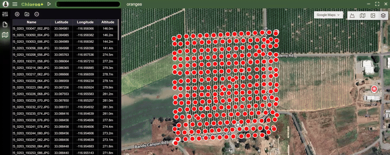

# Začíname

<figure><figcaption></figcaption></figure>
Chloros je softvérová aplikácia od [MAPIR](https://www.mapir.camera) na spracovanie obrázkov a iných údajov zo senzorov.

*****Novinky v Chloros 1.1.0**: Natívna podpora Linux (amd64 a arm64), edge computing NVIDIA Jetson, Dynamic Compute Adaptation, 4-vláknový spracovateľský pipeline, nové príkazy a možnosti CLI. Úplný zoznam zmien nájdete v časti [Stiahnutie](download.md).


Chloros je k dispozícii v 3 režimoch aplikácie:

## Chloros: Aplikácia s grafickým rozhraním pre stolné počítače

Samostatné okno so všetkými funkciami. _Iba pre Windows._

## [Chloros CLI: Rozhranie príkazového riadku](CLI.md)

Hromadné spracovanie z príkazového riadku. Ideálne pre automatizáciu, skriptovanie a prevádzku bez grafického rozhrania. Dostupné na **Windows, Linux amd64 a Linux arm64 (NVIDIA Jetson)**. _Pre prístup k CLI je potrebná licencia Chloros+._

## [Chloros API: Python SDK](api-python-sdk.md)

Programové rozhranie Python pre automatizáciu a vlastné pracovné postupy. Ideálne pre výskumné procesy, integráciu s existujúcimi aplikáciami Python a vytváranie vlastných nástrojov. K dispozícii na **všetkých platformách** prostredníctvom `pip install chloros-sdk`. _Na prístup k API je potrebná licencia Chloros+._***

## Podporované platformy

| Platforma | GUI | CLI | Python SDK |
| --- | --- | --- | --- |
| **Windows 10/11** | Áno | Áno | Áno |
| **Linux amd64 (x86_64)** | Nie | Áno | Áno |
| **Linux arm64 (NVIDIA Jetson)** | Nie | Áno | Áno |

Pokyny na inštaláciu Linux nájdete v časti [Linux a Edge Computing](linux/linux-overview.md).

***

## Chloros+

Hoci je Chloros pre väčšinu úloh k dispozícii zadarmo, možno zistíte, že potrebujete viac. V takom prípade vám môže priniesť výhody platená licencia pre Chloros+. S licenciou Chloros+ môžete odomknúť nové funkcie, ako napríklad:

* **Viacvláknové spracovanie**: výrazne zrýchlite spracovanie obrazu pri väčších projektoch súčasným spracovaním obrázkov v rámci spracovateľského reťazca.
* **Akcelerácia GPU (CUDA)**: využite dnešné možnosti väčšej pamäte GPU na ďalšie zrýchlenie spracovania obrazu. Pre dosiahnutie najlepších výsledkov odporúčame 4 GB alebo viac VRAM.
* **Chloros+**[**CLI**](CLI.md)**Prístup**: spustite Chloros+ z príkazového riadku na automatizáciu a integráciu do vášho vlastného softvéru.
* **Chloros+**[**API**](api-python-sdk.md)**Prístup:** spustite Chloros+ z Python pre programové ovládanie, čo umožňuje hladkú integráciu s vašimi výskumnými procesmi, pracovnými postupmi analýzy údajov a vlastnými aplikáciami.
* **Použitie na viacerých zariadeniach**: každá licencia Chloros+ umožňuje registráciu 2 a viac zariadení. Na správu registrovaných zariadení použite svoj účet MAPIR Cloud. Pridajte podporu pre ďalšie zariadenia aktualizáciou vašej licencie Chloros+.
* **Pokročilá metóda debayeringu s ohľadom na textúru:** vysoko kvalitný debayering s ohľadom na okraje v kombinácii s modelom odšumovania AI/ML, ktorý odstraňuje takmer všetok šum spôsobený debayeringom. 
* **Vlastné vzorce multispektrálnych indexov:** zadávajte vlastné multispektrálne indexy do rastrových kalkulátorov Chloros, a to ako pre spracovanie, tak aj pre sandbox na prezeranie obrázkov.
* **Linux a Edge Computing:** spustite Chloros na platformách Linux x86\_64 a ARM64 vrátane NVIDIA Jetson pre spracovanie v teréne a na okraji siete. Pozrite si [Prehľad Linux](linux/linux-overview.md).

<a href="https://cloud.mapir.camera/pricing" class="button primary" data-icon="envira">Chloros+ Ceny a registrácia</a>

<figure><figcaption></figcaption></figure>

<figure><figcaption></figcaption></figure>

<figure><figcaption></figcaption></figure>

<figure><figcaption></figcaption></figure>

<figure><figcaption></figcaption></figure>

<figure><figcaption></figcaption></figure>
