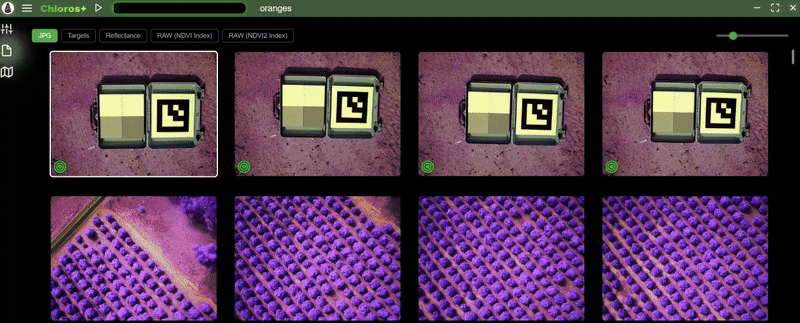

# Začíname

<figure><figcaption></figcaption></figure>

Chloros

je softvérová aplikácia od spoločnosti [MAPIR

](https://www.mapir.camera) určená na spracovanie multispektrálnych snímok, živé ovládanie hardvéruMAPIR

a zaznamenávanie údajov zo senzorov.Chloros

1.2.0 podporuje celú produktovú rodinuMAPIR

:

* **KamerySurvey3** — spracúvajú zábery vo formáte RAW+JPG na kalibrované mapy odrazivosti a vegetačných indexov. Pozrite si [Podporované kamery](supported-cameras.md).
* **Kamery LATTICE** — pripojte multispektrálne kamerové moduly GigE v reálnom čase, jednotlivo alebo ako synchronizované sústavy viacerých kamier: náhľad, snímanie a spracovanie do kalibrovaných produktov žiarivosti a odrazivosti. Pozrite si [sekciu LATTICE](lattice/README.md).
* **Svetelné senzory DAQ** — spektrálne senzory DAQ-U (USB), DAQ-M (Bluetooth) a DAQ-E (Ethernet): kalibrované spektrá v reálnom čase, záznamy `.daq` a osvetlenie smerujúce nadol na spracovanie odrazivosti. Pozrite si [sekciu DAQ](daq/README.md).


**Novinky vo verziiChloros

1.2.0**: ovládanie kamery a matice LATTICE v reálnom čase, integrácia svetelných senzorov DAQ, režimy snímania a záznamové zariadenia, kompletný radiometrický spracovateľský reťazec LATTICE, automatizácia projektov zCLI

/SDK

a mnoho ďalšieho. Pozrite si zoznam noviniek nižšie a [stiahnite si](download.md) zoznam zmien.



**PoužívateChloros

s AI asistentom?** Táto príručka je na to ako stvorená. Nasmerujte svojho asistenta na:

* `https://mapir.gitbook.io/chloros/llms.txt` — strojovo čitateľný index každej stránky.
* Akákoľvek stránka vo formáte surového Markdownu — k jejURL

pridajte `.md` (napr. `https://mapir.gitbook.io/chloros/reference/cli-reference.md`).
* [Referenčná príručkaCLI

](reference/cli-reference.md) a [Referenčná príručkaSDK

](reference/sdk-reference.md) — kompletné referenčné stránky s presnými hodnotami napísané pre použitie veľkými jazykovými modelmi (LLM).

Príklad výzvy: *„Prečítajte si https://mapir.gitbook.io/chloros/reference/cli-reference.md, a potom napíšte skript, ktorý sa prihlási a spracuje priečinok ~/flights/flight_001 do formátu GeoTIFF s odrazivosťou +NDVI

.“*

Kompletný návod: [PoužívanieChloros

s AI asistentmi](ai-assistants.md).


***

## Novinky vo verzii 1.2.0 aplikácie „Chloros

“

* **Ovládanie kamery v reálnom čase — nová karta „Kamery“.** Pripojte kamery LATTICE jednotlivo alebo ako synchronizované sústavy viacerých kamier (časová synchronizácia PTP, snímanie spúšťané hardvérom) s prekrývaním živého náhľadu, histogramami pre jednotlivé pásma, inteligentnou automatickou expozíciou, kalkulátorom indexu v reálnom čase a aktualizáciami firmvéru kamery priamo v aplikácii.
* **Svetelné senzory — nová záložka „Light Sensors“.** Pripojte senzory DAQ-U (USB), DAQ-M (Bluetooth) a DAQ-E (Ethernet); zobraziť kalibrované spektrá v reálnom čase (W/m²/nm), zaznamenať súbory `.daq` do vášho projektu, vybrať profily korekcie kapacity a aktualizovať firmvér DAQ-E cez sieť.
* **Režimy snímania a záznamníky.** Jednorazové / nepretržité / intervalové snímanie plus režim najrýchlejšieho snímania iba v surovom formáte; výber na úrovni projektu, ktoré kamery a typy exportu vytvára funkcia „Capture All“; pole záznamníkov pre indexové video na úrovni monitorovania a surové série na úrovni analýzy s offline zostavovaním videa.
* **Spracovateľský reťazec LATTICE.** Importujte zložky so záznamami LATTICE a každý surový snímok rozložte na produkty bez bayeringu, náhľad, radianciu float32 (W/m²/sr/nm) a odrazivosť s prepínacími tlačidlami pre každý produkt. Reflektancia môže pochádzať z kalibračného cieľa v rámci snímky alebo z DAQ smerujúceho nadol; pri exportoch sa uplatňuje zarovnanie poľa; chýbajúca továrenská kalibrácia sa automaticky stiahne podľa sériového čísla kamery.
* **Projekty si pamätajú hardvér.** Pripojené kamery a svetelné senzory sa ukladajú spolu s projektom (`cameras.json` / `sensors.json`) a pri opätovnom otvorení projektu sa opäť pripoja so svojimi uloženými nastaveniami. Pozrite si [GUI: Projekty](projects.md).
* **Vylepšenia prehliadača obrázkov.** Zobrazenie pixelov/indexu kurzora so správnym škálovaním odrazivosti pre každý súbor, histogramy vrstiev, posuvník pre zlučovanie GSD, režimy mriežky „Per Trigger“ a „Per Camera“, zobrazenia produktov LATTICE a export indexu/LUT do sandboxu na disk.
* **Výrazne rozšírené funkcieCLI

aSDK

.** Nové rodiny príkazov `lattice`, `daq pool-*`, `project` a `time-sync`; nové možnosti `process` (`--input-level`, prepínače pre jednotlivé produkty, `--reflectance-source`, príznaky zarovnania poľa);SDK

inteligentné pripojovacie rukoväte (`connect_camera` / `connect_array` / `connect_daq_sensor`), ktoré automaticky spúšťajú backend; automatizácia `open_project()`; balík „SDK

“ je súčasťou inštalačných balíkov a je zverejnený na PyPI pod názvom `chloros-sdk`.
* **Poctivá sémantika chýb.** Spustenie `chloros-cli process`, ktoré požiadalo o produkty, ale žiadny nezapísalo, teraz zreteľne zlyhá a ukončí sa s nenulovým kódom; úspešné spustenia hlásia, koľko obrazových produktov zapísali.
* **Nové usporiadanie výstupu.** Výstupy sa ukladajú do zložiek `<project>/<camera>/<format>/<Product>_Images/` a zachovávajú názov zdrojového súboru — produkt identifikuje zložka, nie prípona súboru. Pozrite si [Formáty výstupných obrázkov](output-image-formats.md).
* **Viac vstupov, plánov a jazykov.** Podpora vstupov `.dng`; všetkých 38 jazykov rozhrania je plne obsadených; hardvérové obmedzenia na plán s bezplatným (bez prihlásenia) využitím až 4 kamier a 2 svetelných senzorov.
* **Spoľahlivosť.** Funkcia „Zastaviť spracovanie“ sa ukončuje bezchybne s presným súhrnom behu, projekty s viacerými kamerami exportujú údaje z každej kamery a aktualizácie inštalátora vás už neodhlásia.***

AplikáciaChloros

je k dispozícii v 3 rozhraniach:

##Chloros

: Desktopová aplikácia s grafickým rozhraním

Samostatné okno so všetkými funkciami, vrátane kariet „Kamery“ a „Svetelné senzory“ v reálnom čase. _Iba pre Windows._

## [Chloros

CLI

: Rozhranie príkazového riadku](CLI.md)

Hromadné spracovanie z príkazového riadku a príkazy v reálnom čase `lattice`, `daq pool-*`, `project` a `time-sync`. Ideálne pre automatizáciu, skriptovanie a prevádzku bez grafického rozhrania. K dispozícii na **Windows

,Linux

amd64 aLinux

arm64 (NVIDIA Jetson)**. _Pre prístup k CLI je potrebná platená úroveňChloros

+._

## [Chloros

API

:Python

SDK

](api-python-sdk.md)

Programové rozhraniePython

pre automatizáciu a vlastné pracovné postupy: spracovanie celého potrubia, relácie s živou kamerou/políkom, relácie so senzormi DAQ a automatizácia uložených projektov. Inštaluje sa spolu s balíkom desktop/CLI

a je tiež publikovaný ako `pip install chloros-sdk`. _Pre prístup k API je potrebná platená úroveňChloros

+._

***

## Podporované platformy

| Platforma | GUI |CLI

|Python

SDK

|
| --- | --- | --- | --- |
| **Windows

10/11 (x64)** | Áno | Áno | Áno |
| **Linux

amd64 (x86_64)** | Nie | Áno | Áno |
| **Linux

arm64 (NVIDIA Jetson)** | Nie | Áno | Áno |

Pokyny na inštaláciu v prostredíLinux

nájdete v časti [Linux

a Edge Computing](linux/linux-overview.md).

***

## Začíname v troch krokoch

1. **Inštalácia** — stiahnite si a spustite inštalačný program pre vašu platformu. Pozrite si časť [Stiahnutie](download.md).
2. **Prihláste sa (voliteľné pre grafické rozhranie)** — grafické rozhranie spracováva obrázky zadarmo aj bez účtu. [Chloros

+ prihlásenie](chloros+-login.md) odomkne paralelné spracovanie, akceleráciu GPU, vyššie limity zariadení a prístup naCLI

/SDK

.
3. **Vytvorte svoj prvý projekt** — otvorte stránkuChloros

, vytvorte [nový projekt](projects.md), [pridajte svoje obrázky](processing-images-gui/adding-files-to-a-project.md) a [spustite spracovanie](processing-images-gui/starting-the-processing.md). Ak chcete namiesto toho ovládať hardvér v reálnom čase, otvorte kartu Kamery alebo Svetelné senzory — pozrite si [GUI: Navigácia](navigation.md).

***

##Chloros

+

Hoci jeChloros

pre väčšinu úloh k dispozícii zadarmo, možno zistíte, že potrebujete viac. V takom prípade vám môže pomôcť platená licencia preChloros

+. S licenciouChloros

+ môžete odomknúť nové funkcie, ako napríklad:

* **Viacvláknové spracovanie**: výrazne zrýchlite spracovanie obrazu pri väčších projektoch súbežným spracovaním obrázkov v spracovateľskom reťazci.
* **Akcelerácia pomocou GPU (CUDA)**: využite dnešné možnosti väčšej pamäte GPU na ďalšie zrýchlenie spracovávania obrázkov. Pre dosiahnutie najlepších výsledkov odporúčame 4 GB alebo viac VRAM.
* **Prístup kChloros

+**[**CLI**](CLI.md): spustiteChloros

+ z príkazového riadku na automatizáciu a integráciu do vášho vlastného softvéru. K dispozícii vo všetkých platených úrovniach; vynucované na strane servera.
* **Chloros

+**[**API**](api-python-sdk.md) **Prístup:** spustite príkazChloros

+ z adresyPython

pre programové ovládanie, čo umožňuje plynulú integráciu s vašimi výskumnými postupmi, pracovnými tokmi analýzy dát a vlastnými aplikáciami. K dispozícii v každom platenom balíku; vynucované na strane servera.
* **Vyššie hardvérové limity**: pripojte naraz viac kamier a svetelných senzorov. Bez prihlásenia sa grafické používateľské rozhranie pripojí k maximálne 4 kamerám a 2 svetelným senzorom DAQ; platené tarify zvyšujú oba limity:

| Tarifa | Kamery | Svetelné senzory DAQ |
| --- | --- | --- |
| Iron (bezplatný, bez prihlásenia) | 4 | 2 |
| Copper / Bronze | 6 | 3 |
| Silver | 10 | 6 |
| Gold | 20 | 12 |

* **Použitie viacerých zariadení**: každá licenciaChloros

+ umožňuje registráciu 2 a viac zariadení. Na správu registrovaných zariadení použite svoj účetMAPIR

Cloud. Podporu pre ďalšie zariadenia získate aktualizáciou licencieChloros

+.
* **Pokročilá metóda debayeringu zohľadňujúca textúru:** vysokokvalitný debayering zohľadňujúci hrany v kombinácii s modelom odšumovania založeným na umelej inteligencii a strojovom učení, ktorý odstraňuje takmer všetok šum spôsobený debayeringom.
* **Vlastné vzorce multispektrálnych indexov:** zadávajte vlastné multispektrálne indexy v rastrových kalkulátorochChloros

, a to ako pre spracovanie, tak aj pre testovacie prostredie na prezeranie obrázkov.
* **PlatformaLinux

a a spracovanie na okraji siete:** spúšťajte platformuChloros

na platformáchLinux

x86\_64 a ARM64, vrátane NVIDIA Jetson, pre spracovanie v teréne a na okraji siete. Pozrite si [Linux

Prehľad](linux/linux-overview.md).

<a href="https://cloud.mapir.camera/pricing" class="button primary" data-icon="envira">Chloros+ Ceny a registrácia</a>

<figure><figcaption></figcaption></figure>

<figure><figcaption></figcaption></figure>

<figure><figcaption></figcaption></figure>

<figure><figcaption></figcaption></figure>

<figure><figcaption></figcaption></figure>

<figure><figcaption></figcaption></figure>
<!-- SCREENSHOT-UPDATE: cli.JPG shows the 1.1.0 CLI banner. Re-shoot a terminal running `chloros-cli --version` + `chloros-cli status` on the 1.2.0 build so the banner prints "Chloros CLI 1.2.0". -->
