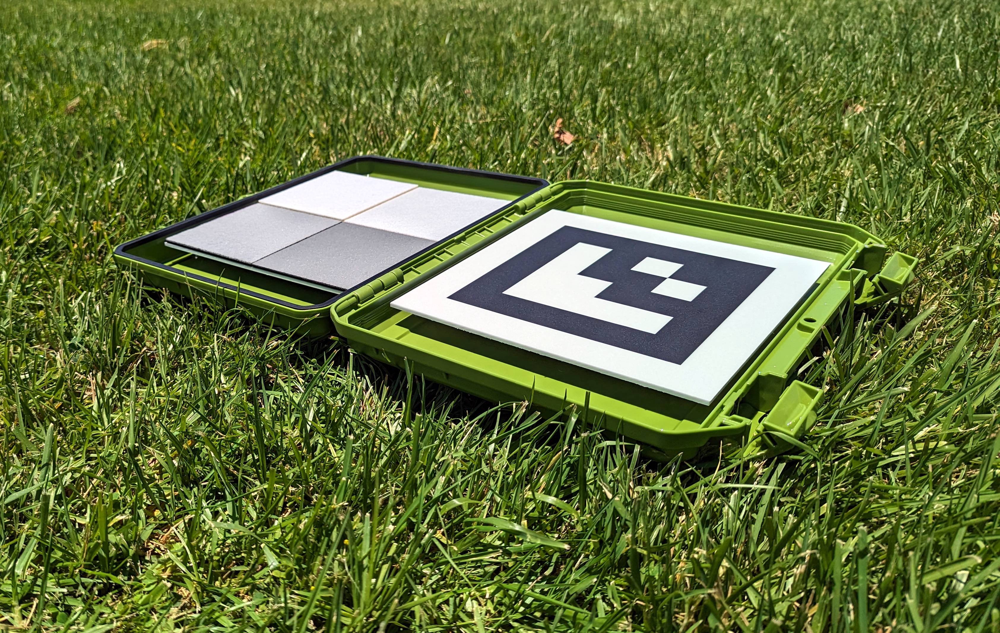

# Kalibračné terče

MAPIR ponúka rôzne kalibračné terče pre širokú škálu aplikácií. Kompaktný model T4-R50, ktorý vidíte nižšie, obsahuje 4 panely, ktorých odrazivosť svetla bola meraná v rozsahu 250 – 2 500 nm.

<figure><figcaption>
MAPIR T4-R50
</figcaption></figure>Difúzne referenčné terče T4 majú nasledujúce krivky odrazivosti, [údaje si môžete stiahnuť tu](https://cdn.shopify.com/s/files/1/0972/5566/files/MAPIR_Diffuse_Reflectance_Standard_Calibration_Target_Data_T4.xlsx?v=1741759157):

<figure><figcaption>
MAPIR Odrazivosť T4 :: 250–2 500 nm
</figcaption></figure>

<figure><figcaption>
MAPIR Odrazivosť T4 :: 400–1 000 nm
</figcaption></figure>Difúzne referenčné terče T4P majú nasledujúce krivky odrazivosti, [dáta na stiahnutie tu](https://cdn.shopify.com/s/files/1/0972/5566/files/MAPIR_Diffuse_Reflectance_Standard_Calibration_Target_Data_T4.xlsx?v=1741759157):

<figure><figcaption>
MAPIR T4P odrazivosť :: 250–2500 nm
</figcaption></figure>

<figure><figcaption>
MAPIR T4P Odrazivosť :: 400–1000 nm
</figcaption></figure>Pri pohľade na graf odrazivosti vidíte, že hodnoty predstavujú vlnovú dĺžku (os x) v porovnaní s percentom odrazivosti (os y). Keď nasnímame obraz kalibračného terčíka, vytvoríme vzťah medzi hodnotou pixelu a percentom odrazivosti v rámci spektra, na ktoré je citlivé každé z pásiem snímača kamery.

To znamená, že pri každom snímku, ktorý zachytíte našimi kamerami, môžete použiť fotografiu našich kalibračných terčov, napríklad [T4-R50](https://www.mapir.camera/collections/calibration-targets/products/diffuse-reflectance-standard-calibration-target-package-t3-r50) alebo [T4-R125](https://www.mapir.camera/collections/multispectral-reflectance-reference-calibration-targets/products/diffuse-reflectance-standard-calibration-target-package-t4-r125), na kalibráciu snímok z hľadiska odrazivosti. Po kalibrácii sa každý pixel na snímke rovná percentuálnej hodnote odrazivosti.

V prípade výstupov **Survey3** , ak exportujete kalibrované snímky v formáte Chloros ako bežné JPG alebo TIFF, percentuálna hodnota odrazivosti sa vypočíta vydelením hodnoty pixelu bitovou hĺbkou formátu snímky. Pre formát JPG teda vydelíte hodnotu pixelov číslom 255 a pre formát TIFF číslom 65 535. Môžete tiež zvoliť výstup vo formáte PERCENT v súbore Chloros, pričom každý pixel bude mať hodnotu v rozmedzí od 0,0 do 1,0 (od 0 % do 100 % odrazivosti). Majte však na pamäti, že niektoré aplikácie na prácu s obrázkami nepodporujú obrázky v percentách (s plávajúcou desatinnou čiarkou) a z hľadiska úložného priestoru sú tieto súbory veľké.


**Odrazivosť LATTICE používa odlišné mierky pixelov.** Odrazivosť LATTICE sa ukladá s hodnotou DN 32768 = 100 % odrazivosti (nie 65535) a každý súbor obsahuje značku XMP `Chloros:PixelScale`, ktorá uvádza jeho mierku. Prečítajte si tento tag a vydelte ním hodnotu, namiesto toho, aby ste predpokladali konštantu — pozrite si [Formáty výstupných obrázkov](output-image-formats.md).


## Kalibračné terče s kamerami LATTICE

Pri kamerách LATTICE je kalibračný terč pre odrazivosť **voliteľný**: Chloros môže namiesto toho odrazivosť vzťahovať na intenzitu dopadajúceho žiarenia meranú svetelným senzorom DAQ (ρ = π·L/E). Referenčná hodnota sa volí pomocou nastavenia zdroja odrazivosti (Nastavenia projektu v grafickom rozhraní; `--reflectance-source` v CLI; `reflectance_source` v SDK):

| Hodnota | Správanie |
| --- | --- |
| `auto` *(predvolené)* | Cieľ v rámci snímky, ktorý prešiel kontrolou kvality (QA), je **absolútnou referenciou**; ak nie je prítomný žiadny cieľ alebo ak kontrola kvality zlyhá, Chloros prejde na delenie smerom nadol z DAQ. |
| `target` | Prísne len cieľ — bez nahradenia DAQ. |
| `daq` | DAQ má prednosť — meranie smerom nadol je vždy referenciou. |

Dodatočné správanie cieľov pre LATTICE:

* **Geometrie cieľov** — podporované sú panely označené ArUco, panely s pevnou oblasťou záujmu (ROI) a pásové ciele; geometria pochádza z konfigurácie cieľov projektu.
* **Dáta o meraných cieľoch na jednotku** — `--target-reflectance-dir DIR` odkazuje na adresár skenov odrazivosti meraných cieľov na jednotku (`<serial>.csv`, vyhľadávaných podľa sériového čísla/QR kódu jednotky cieľa). V prípade neúspechu sa Chloros vráti k nominálnym spektrám T3/T4P.
* **Časové ukotvenie** — detegovaný cieľ kalibruje snímky v jeho okolí a je udržiavaný medzi pozorovaniami cieľa.

Úplná sémantika príznakov a príklady sú uvedené v [Referencii CLI](reference/cli-reference.md) (pozri „Prepínače exportu podľa produktu“).

### F988

„Odrazivosť F988 je kalibrovaná pomocou panelu odrazivosti v scéne: pásmo leží mimo kalibrovaného rozsahu svetelného senzora DAQ, takže Chloros použije váš najnovší záznam z panelu a udrží ho medzi pozorovaniami panelu.“

Ak sa F988 spustí s kalibráciou iba pomocou DAQ, Chloros odmietne odrazivosť založenú na DAQ pre dané pásmo a uvedie dôvod (dôvod preskočenia `dls-uncalibrated-band-988`); podporovaným postupom je použitie panelu.

<figure><figcaption>
T4-R125
</figcaption></figure> <figure><figcaption>
T4-R125
</figcaption></figure> <figure><figcaption>
T4-R125
</figcaption></figure>

