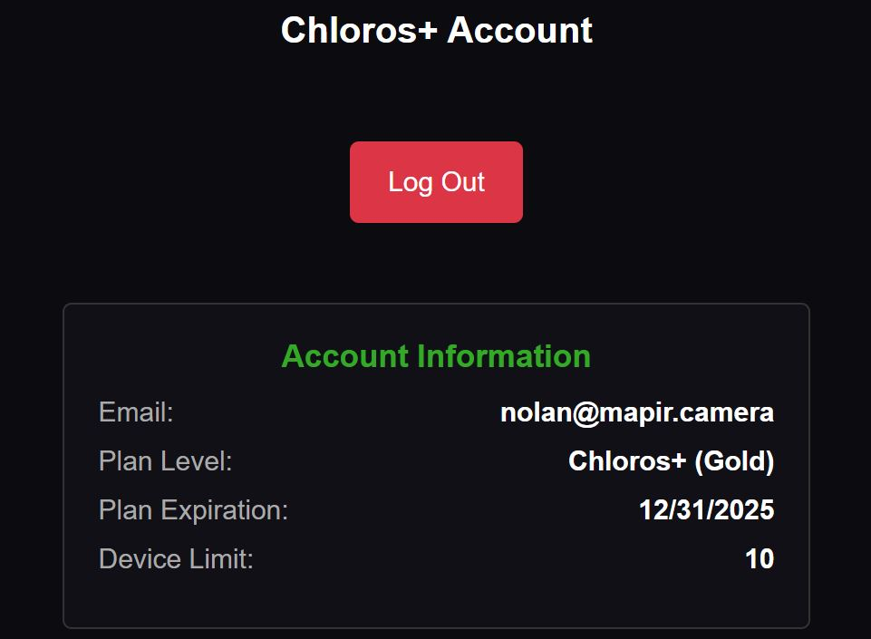

# Prihlásenie do Chloros+

## Prihlásenie do Chloros a Chloros (prehliadač)

Bočné menu  v bočnom paneli vám umožňuje prihlásiť sa do vášho účtu Chloros+ a odomknúť ďalšie funkcie.

Po prihlásení sa zobrazia podrobnosti vášho účtu:

<figure><figcaption></figcaption></figure>## Prihlásenie do CLI

Prihláste sa pomocou svojich prihlasovacích údajov do Chloros+, aby ste povolili spracovanie v CLI. V Linux (bez grafického rozhrania) je to jediný spôsob, ako aktivovať vašu licenciu.

**Syntax:**

```bash
chloros-cli login <email> <password>
```


**Používatelia SDK**: Python SDK poskytuje aj programovú metódu `logout()` na vymazanie prihlasovacích údajov v cache. Podrobnosti nájdete v [dokumentácii k metóde Python SDK](api-python-sdk.md#logout).


**Príklad:**

```powershell
chloros-cli login user@example.com 'MyP@ssw0rd123'
```


**Špeciálne znaky**: Heslá obsahujúce znaky ako `$`, `!` alebo medzery uzavrite do jednoduchých úvodzoviek.


**Výstup:**

<figure><figcaption></figcaption></figure>### Ukladanie prihlasovacích údajov

Uložené prihlasovacie údaje sa ukladajú na mieste špecifickom pre danú platformu:

| Platforma | Cesta k vyrovnávacej pamäti prihlasovacích údajov |
| --- | --- |
| **Windows** | `%APPDATA%\Chloros\cache\` |
| **Linux** | `~/.cache/chloros/` |

### Vypršanie platnosti plánu

Vypršanie platnosti plánu v grafickom rozhraní (GUI) ukazuje, kedy vaša licencia prestane platiť. Pri opakovaných mesačných predplatných je to na konci mesiaca. Pri ročných predplatných je to rok po začatí predplatného. Overenie licencie vyžaduje mesačné pripojenie k internetu, s 30-dňovou tolerančnou lehotou.

### Limit zariadení

Každý plán Chloros+ ponúka iný počet registrovaných zariadení. Každé zariadenie, na ktorom sa prihlásite pomocou účtu Chloros+, sa započítava do počtu vašich registrovaných zariadení. Zariadenie môžete premenovať a odstrániť na stránke vášho účtu MAPIR Cloud.

<table><thead><tr><th width="168.5999755859375" align="right">Plán Chloros+</th><th align="center">MEĎ</th><th align="center">BRONZE</th><th align="center">SILVER</th><th align="center">GOLD</th></tr></thead><tbody><tr><td align="right">Podporované zariadenia</td><td align="center">2</td><td align="center">2</td><td align="center">5</td><td align="center">10</td></tr></tbody></table>
