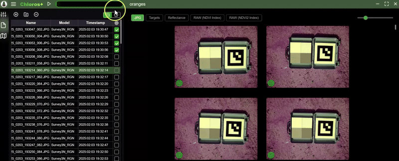

# Pridávanie súborov do projektu

Po vytvorení alebo otvorení projektu v programe Chloros je ďalším krokom pridanie multispektrálnych snímok, aby ste mohli začať so spracovaním. Kartu Prehliadač súborov umožňuje jednoduchý import snímok a správu vašej sady údajov.

## Prístup k prehliadaču súborov

1. Otvorte alebo vytvorte projekt v Chloros
2. Kliknite na ikonu **Prehliadač súborov**  v ľavom bočnom paneli
3. V paneli Prehliadač súborov sa zobrazí zoznam súborov vášho projektu


**Podporované typy súborov**: Chloros podporuje obrazové súbory formátu RAW+JPG a JPG z fotoaparátov MAPIR, Survey3W a Survey3N. Odporúčajú sa iba súbory formátu RAW+JPG.


***

## Pridávanie obrázkov do projektu

Existujú dva hlavné spôsoby pridávania obrázkov do projektu:

### Spôsob 1: Pridať súbory

Túto možnosť použite na importovanie jednotlivých obrazových súborov alebo malého výberu súborov.

1. Kliknite na tlačidlo **„Pridať súbory“**  v hornej časti panela prehliadača súborov
2. Prejdite do priečinka obsahujúceho vaše obrázky
3. Vyberte jeden alebo viacero obrazových súborov (podržte kláves **Ctrl** na výber viacerých súborov)
4. Kliknite na **„Otvoriť“** na importovanie vybraných súborov

### Metóda 2: Pridať priečinok

Túto možnosť použite na importovanie všetkých obrázkov z priečinka naraz.

1. Kliknite na tlačidlo **„Pridať zložku“**  v hornej časti panela Prehliadač súborov
2. Prejdite do priečinka obsahujúceho obrázky zo snímacej relácie a vyberte ho
3. Kliknite na **„Vybrať priečinok“**, aby ste importovali všetky podporované obrázky z tohto priečinka***

## Vysvetlenie tabuľky prehliadača súborov

Po importovaní sa obrázky zobrazia v tabuľke s nasledujúcimi stĺpcami:

### Názov súboru

* Pôvodný názov súboru z fotoaparátu
* Zachováva konvenciu pomenovania fotoaparátu (napr. IMG\_0001.RAW)

### Časová pečiatka

* Dátum a čas zachytenia obrázku
* Extrahované z metadát EXIF obrázku
* Používa sa na synchronizáciu PPK a detekciu kalibračných cieľov

### Model fotoaparátu

* Automaticky zistená konfigurácia fotoaparátu a filtrov
* Príklady: Survey3W\_RGN, Survey3N\_OCN, Survey3W\_RGB
* Používa sa na aplikovanie správnych profilov spracovania

### Stĺpec cieľa (zaškrtávacie políčko)

* Zaškrtnite toto políčko pre obrázky, ktoré obsahujú kalibračné ciele
* Výrazne urýchľuje detekciu cieľov počas spracovania
* Podrobnosti nájdete v časti [Výber obrázkov s cieľmi](choosing-target-images.md)

### Zobrazenie metadát obrázkov

Kliknutím na prepínač v pravom hornom rohu nad tabuľkou sa v oblasti mriežky obrázkov zobrazia metadáta vybraného obrázku.

<figure><figcaption></figcaption></figure>

***

## Správa súborov vo vašom projekte

### Odstránenie súborov

Ak chcete z projektu odstrániť nepotrebné obrázky:

1. Vyberte jeden alebo viac obrázkov v tabuľke prehliadača súborov
2. Kliknite na tlačidlo **„Odstrániť vybrané“**  .
3. Potvrďte odstránenie (súbory sa z disku neodstránia, iba sa odstránia z projektu).

### Triedenie a filtrovanie

* **Triedenie podľa stĺpca**: Kliknutím na akýkoľvek záhlavie stĺpca môžete obrázky zoradiť.
* **Triedenie podľa časovej pečiatky**: Užitočné na usporiadanie chronologických sekvencií záberov.
* **Filter podľa modelu fotoaparátu**: Ak používate viacero fotoaparátov, môžete obrázky zoskupiť podľa typu fotoaparátu.***

## Náhľad obrázku

### Zobrazenie celého obrázku

Kliknite na ľubovoľnú miniatúru obrázku v prehliadači súborov, aby sa zobrazil v hlavnej oblasti náhľadu:

1. Obrázok sa zobrazí v strednom paneli náhľadu
2. Použite ovládacie prvky priblíženia na kontrolu detailov obrázku
3. Prechádzajte medzi obrázkami pomocou klávesov so šípkami

### Rýchla navigácia

* **Predchádzajúci obrázok**: Kliknite na šípku doľava alebo stlačte kláves ←
* **Ďalší obrázok**: Kliknite na šípku doprava alebo stlačte klávesu →
* **Priblíženie/oddialenie**: Použite koliesko myši alebo tlačidlá priblíženia
* **Posúvanie**: Pri priblížení kliknite a ťahajte po obrázku***

## Spracovanie duplicitných súborov

Chloros automaticky detekuje a ignoruje duplicitné súbory:

* Súbory s identickými názvami sú preskočené
* Zabraňuje náhodnému dvojitému spracovaniu
* Pri detekcii duplikátov sa zobrazí varovná správa


**Dôležité**: Pred importom nepremenúvajte ani nemodifikujte svoje pôvodné obrazové súbory. Chloros sa spolieha na pôvodné názvy súborov a metadáta pre správne spracovanie.


***

## Zmiešané súbory údajov z kamier

Ak váš projekt obsahuje obrázky z viacerých kamier MAPIR:

1. Chloros automaticky rozpozná každý model kamery
2. Každý typ kamery sa spracováva s príslušným kalibračným profilom
3. Prehliadač súborov zobrazuje model kamery v stĺpci Model kamery
4. Spracovanie uplatňuje správne nastavenia pre každý typ kamery

**Príklad scenára**: Survey3W RGN + Survey3N OCN konfigurácia s dvoma kamerami***

## Osvedčené postupy

### Usporiadajte pred importom

* Uložte kalibračné cieľové snímky do rovnakého priečinka ako snímky z prieskumu
* Zachovajte pôvodnú štruktúru priečinkov z fotoaparátu/SD karty
* Nemiešajte dátové súbory z rôznych sedení v jednom projekte

### Pomenovanie súborov

* Zachovajte pôvodné názvy súborov z fotoaparátu (IMG\_0001.RAW atď.)
* Nepremenúvajte súbory pred importom
* Pôvodné názvy obsahujú dôležité metadáta

### Kalibračné cieľové snímky

* Vždy zahrňte 1–2 kalibračné cieľové snímky na jednu reláciu
* Zachyťte ciele pred a po relácii snímania
* Umiestnite ciele do rovnakých svetelných podmienok ako oblasť snímania
* Označte cieľové snímky pomocou začiarkavacieho políčka Cieľ, aby ste urýchlili spracovanie

***

## Bežné problémy a riešenia

### Snímky sa nezobrazujú po importe

**Možné príčiny:**

* Nepodporovaný formát súboru (len RAW+JPG a JPG z fotoaparátov MAPIR)
* Obrázky pochádzajú z fotoaparátov iných ako MAPIR (pozri [Podporované fotoaparáty](../supported-cameras.md))
* Poškodenie súboru alebo neúplný prenos z SD karty

**Riešenie**: Overte kompatibilitu formátu súboru a modelu fotoaparátu

### Model fotoaparátu nebol rozpoznaný

**Možné príčiny:**

* Upravené metadáta EXIF
* Obrázky upravené v externom softvéri
* Neúplný prenos súborov

**Riešenie**: Znovu importujte pôvodné, neupravené súbory z fotoaparátu/SD karty

### Chýbajúce časové údaje

**Možné príčiny:**

* Nesprávne nastavené hodiny fotoaparátu
* EXIF údaje odstránené externým softvérom

**Riešenie**: Overte, či bolo nastavenie času fotoaparátu počas snímania správne***

## Ďalšie kroky

Po importovaní súborov:

1. **Skontrolujte zoznam súborov** – Uistite sa, že sa všetky obrázky načítali správne
2. **Skontrolujte modely fotoaparátov** – overte správne rozpoznanie fotoaparátu
3. **Označte cieľové obrázky** – pozrite si [Výber cieľových obrázkov](choosing-target-images.md)
4. **Upravte nastavenia** – nakonfigurujte možnosti spracovania v [Nastaveniach projektu](adjusting-project-settings.md)
5. **Spustite spracovanie** – pozrite si [Spustenie spracovania](starting-the-processing.md)

Podrobné informácie o konfigurácii projektu nájdete v časti [Úprava nastavení projektu](adjusting-project-settings.md).
