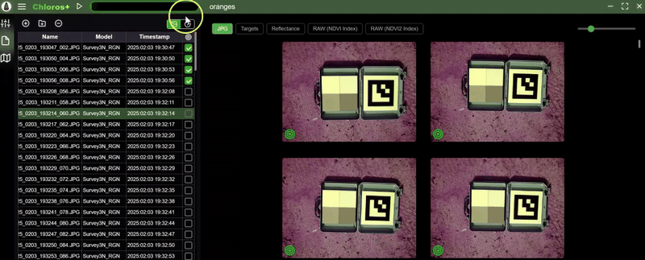

# Pridávanie súborov do projektu

Po vytvorení alebo otvorení projektu v programe Chloros je ďalším krokom pridanie multispektrálnych snímok, aby ste mohli začať so spracovaním. Karta „Prehliadač súborov“ () uľahčuje import snímok a správu vašej sady údajov.

## Otvorenie prehliadača súborov

1. Otvorte alebo vytvorte projekt v programe Chloros
2. Kliknite na ikonu **Prehliadač súborov**  v ľavom bočnom paneli
3. V paneli Prehliadač súborov sa zobrazí zoznam súborov vášho projektu


**Podporované typy súborov**:

* **Survey3W / Survey3N**: Páry súborov RAW+JPG a obrázky vo formáte JPG (odporúča sa RAW+JPG)
* **LATTICE**: záznamy `.tif` / `.tiff` — zaznamenané pomocou ovládania kamery Chloros alebo prostredníctvom rozbočovača LATTICE
* **Údaje zo svetelného senzora**: Záznamy `.daq` (DAQ-U/M/E) a záznamy o dopade svetla z DAQ-M `.csv` — importované spolu so snímkami na účely kalibrácie odrazivosti


***

## Pridávanie snímok do projektu

Existujú dva hlavné spôsoby, ako pridať snímky do projektu:

### Spôsob 1: Pridať súbory

Túto možnosť použite na import jednotlivých obrazových súborov alebo malého výberu súborov.

1. Kliknite na tlačidlo **„Pridať súbory“**  v hornej časti panela Prehliadač súborov
2. Prejdite do priečinka obsahujúceho vaše obrázky
3. Vyberte jeden alebo viacero obrazových súborov (podržte kláves **Ctrl** na výber viacerých súborov)
4. Kliknite na **„Otvoriť“** na import vybraných súborov

### Spôsob 2: Pridať zložku

Túto možnosť použite na import všetkých obrázkov zo zložky naraz. V jednom dialógovom okne môžete vybrať **viacero zložiek**.

1. Kliknite na tlačidlo **„Pridať zložku“**  v hornej časti panela Prehliadač súborov
2. Prejdite do zložky (zložiek) obsahujúcej obrázky z vašej snímacej relácie a vyberte ju (ich)
3. Kliknite na **„Vybrať zložku“**, aby ste importovali všetky podporované obrázky


**Súbory, ktoré sa nepodarilo načítať, sú nahlásené.** Ak zložka obsahuje súbory, ktoré Chloros rozpozná, ale nedokáže načítať, zobrazí sa varovanie – obrázky sa z mriežky nestratia bez upozornenia.


***

## Importovanie zložiek s dátami z LATTICE Capture

Dáta z LATTICE Capture sa ukladajú s **jednou podzložkou na každú úroveň exportu** — napríklad `raw/`, `debayered/`, `radiance/`, `reflectance/`, `preview/` — s príslušným súborom `.daq` v koreňovom adresári:

```
output/
├── raw/           capture_<timestamp>_SN<serial>_raw.tif
├── debayered/     capture_<timestamp>_SN<serial>_debayered.tif
├── preview/       capture_<timestamp>_SN<serial>_display.tif
└── *.daq          the downwelling reading matched to the capture
```

**Nastavte priečinok na koreňový priečinok snímok** (`output/` vyššie). Ak vybraný priečinok sám o sebe neobsahuje žiadne obrázky, ale má podpriečinky, Chloros do nich automaticky prejde — podpriečinky na danej úrovni aj koreňový priečinok `.daq` sa načítajú naraz.**Ako prebieha import snímok:*** Každá séria snímok sa importuje ako **jeden obrázok**, zoskupený podľa série (nie jeden záznam na úroveň). Ostatné úrovne tej istej série snímok sa zobrazujú ako režimy zobrazenia tohto jedného obrázku.
* **Spracovanie vždy začína od surového snímku.** Ostatné úrovne sú viditeľné, ale cez spracovateľský reťazec prechádza vždy len `raw` — opätovné spracovanie už spracovaného produktu by znamenalo dvojité uplatnenie korekcií, preto sa Chloros odmietne. Opätovne importovaný export nikdy nemôže obsadiť slot surového snímku.
* Zložka so snímkami uložená **bez** surových snímok sa načíta a zobrazí normálne, ale spracovanie ju preskočí a zaznamená to do protokolu. (Príznak CLI `--input-level` môže v tomto prípade vynútiť vstupný bod – pozri [Referenciu CLI](../reference/cli-reference.md#what-a-captures-folder-looks-like).)**Relácie LATTICE hub** sa importujú rovnakým spôsobom: v položke „Add Folder“ (Pridať priečinok) vyberte priečinok relácie skopírovaný z hubu (obsahuje súbory `raw/` a `previews/`) spolu s akýmkoľvek protokolom DAQ-M `.csv`. Ak kalibrácia kamery alebo zariadenia DAQ ešte nie je uložená v cache vášho počítača, Chloros ju pri importe automaticky načíta na základe sériového čísla (vyžaduje jednorazové pripojenie k internetu).***

## Vysvetlenie tabuľky prehliadača súborov

Po importe sa snímky zobrazia v tabuľke s nasledujúcimi stĺpcami:

### Názov súboru

* Pôvodný názov súboru z fotoaparátu
* Zachováva konvenciu pomenovania fotoaparátu (napr. IMG\_0001.RAW alebo capture\_20260816\_101500\_SN213800234\_raw.tif)

### Časová pečiatka

* Dátum a čas nasnímania obrázku
* Získané z metadát EXIF obrázku
* Používa sa na zosúladenie svetelných senzorov, synchronizáciu PPK a plánovanie kalibračných cieľov

### Model fotoaparátu

* Automaticky zistená konfigurácia fotoaparátu a filtra
* Príklady Survey3: Survey3W\_RGN, Survey3N\_OCN, Survey3W\_RGB
* Príklady LATTICE: LATT-M3M-L41-F550, LATT-M3C-L87-FRGN
* Slúži na použitie správnych profilov spracovania

### Stĺpec cieľov (zaškrtávacie políčko)

* Toto políčko zaškrtnite pri obrázkoch, ktoré obsahujú kalibračné ciele
* Ak je zaškrtnutý aspoň jeden obrázok, **skenujú sa iba zaškrtnuté obrázky** na prítomnosť cieľov
* Podrobnosti nájdete v časti [Výber cieľových obrázkov](choosing-target-images.md)

### Zobrazenie metadát obrázkov

Kliknutím na prepínač v pravom hornom rohu nad tabuľkou sa v oblasti mriežky obrázkov zobrazia metadáta vybraného obrázku.

<figure><figcaption></figcaption></figure>

***

## Súbory svetelných senzorov vo vašom projekte

* Súbory `.daq` a `.csv` sa zobrazujú v zozname prehliadača súborov, nie sú však klikateľnými snímkami — poskytujú údaje o dopadajúcom ožiarení pre kalibráciu odrazivosti.
* Každý importovaný súbor typu `.daq`/`.csv` je uvedený v časti **Nastavenia projektu → Svetelný senzor DAQ**, kde si môžete skontrolovať korekciu difúzneho krytu platnú pre každý súbor. Pozrite si [Úprava nastavení projektu](adjusting-project-settings.md).
* Záznamy, ktoré vytvoríte na karte **Svetelné senzory**, sa automaticky pridajú do otvoreného projektu – nie je potrebný žiadny ručný import.***

## Správa súborov vo vašom projekte

### Odstránenie súborov

Ak chcete z projektu odstrániť nepotrebné obrázky:

1. Vyberte jeden alebo viac obrázkov v tabuľke prehliadača súborov
2. Kliknite na tlačidlo **„Odstrániť vybrané“** 
3. Potvrďte odstránenie (súbory sa z disku nevymažú, iba sa odstránia z projektu)

### Triedenie a filtrovanie

* **Triedenie podľa stĺpca**: Kliknutím na akýkoľvek nadpis stĺpca môžete obrázky zoradiť
* **Triedenie podľa časovej pečiatky**: Užitočné pri organizovaní chronologických sekvencií záberov
* **Filtrovanie podľa modelu fotoaparátu**: Zoskupte obrázky podľa typu fotoaparátu, ak používate viacero fotoaparátov***

## Náhľad obrázkov

### Zobrazenie celého obrázku

Kliknutím na ľubovoľnú miniatúru obrázku v prehliadači súborov ho zobrazíte v hlavnej oblasti náhľadu:

1. Obrázok sa zobrazí v strednom paneli náhľadu
2. Pomocou ovládacích prvkov priblíženia si prezrite detaily obrázku
3. Medzi obrázkami sa pohybujte pomocou klávesov so šípkami

### Rýchla navigácia

* **Predchádzajúci obrázok**: Kliknite na šípku doľava alebo stlačte kláves ←
* **Ďalší obrázok**: Kliknite na šípku doprava alebo stlačte kláves →
* **Zväčšenie/zmenšenie**: Použite koliesko myši alebo tlačidlá na priblíženie a oddialenie
* **Posun**: Pri zväčšení kliknite a ťahajte po obrázku***

## Spracovanie duplicitných súborov

Chloros automaticky detekuje a ignoruje duplicitné súbory:

* Súbory s identickými názvami sa preskočia
* Zabraňuje náhodnému dvojitému spracovaniu
* Pri detekcii duplikátov sa zobrazí varovná správa


**Dôležité**: Pred importom nepremenúvajte ani neupravujte pôvodné obrazové súbory. Chloros sa pri správnom spracovaní spolieha na pôvodné názvy súborov a metadáta.


***

## Zmiešané súbory údajov z kamier

Ak váš projekt obsahuje snímky z viacerých kamier MAPIR:

1. Chloros automaticky rozpozná každý model kamery — Survey3, LATTICE alebo ich kombináciu
2. Každý typ kamery sa spracováva s príslušným kalibračným profilom
3. Prehliadač súborov zobrazuje model kamery v stĺpci „Model kamery“
4. Každá kamera má po spracovaní vlastnú štruktúru výstupných priečinkov

**Príklady scenárov**: Konfigurácia s dvoma kamerami Survey3W a RGN + Survey3N a OCN, alebo pole LATTICE s hlavnou kamerou RGB a viacerými úzkopásmovými modulmi***

## Osvedčené postupy

### Usporiadajte súbory pred importom

* Uložte snímky kalibračných terčov do rovnakého priečinka ako snímky z prieskumu
* Súbory zo svetelných senzorov `.daq` / `.csv` z každej snímacej relácie uchovávajte spolu so snímkami z danej relácie
* Zachovajte pôvodnú štruktúru zložiek z fotoaparátu/SD karty/rozbočovača
* Nemiešajte dátové súbory z rôznych sedení v jednom projekte

### Pomenovanie súborov

* Zachovajte pôvodné názvy súborov z fotoaparátu (IMG\_0001.RAW, capture\_..., atď.)
* Pred importom súbory nepremenúvajte
* Pôvodné názvy obsahujú dôležité metadáta

### Snímky kalibračných cieľov

* Vždy zahrňte 1–2 snímky kalibračných cieľov na jednu reláciu (Survey3; v prípade LATTICE ich môže nahradiť záznam z DAQ — pozri [Výber snímok cieľov](choosing-target-images.md))
* Zachyťte ciele pred a po snímacej relácii
* Umiestnite ciele do rovnakých svetelných podmienok ako snímacia oblasť
* Označte cieľové obrázky pomocou začiarkavacieho políčka „Target“

***

## Bežné problémy a riešenia

### Obrázky sa po importe nezobrazujú

**Možné príčiny:**

* Nepodporovaný formát súboru (pozri zoznam podporovaných typov v hornej časti tejto stránky)
* Obrázky pochádzajú z fotoaparátov, ktoré nie sú typu MAPIR (pozri [Podporované fotoaparáty](../supported-cameras.md))
* Poškodenie súboru alebo neúplný prenos z SD karty

**Riešenie**: Overte kompatibilitu formátu súboru a modelu fotoaparátu a skontrolujte varovanie pri načítaní súborov, kde sú uvedené presné súbory, pri ktorých došlo k chybe

### Model fotoaparátu nebol rozpoznaný

**Možné príčiny:**

* Upravené metadáta EXIF
* Obrázky upravené v externom softvéri
* Neúplný prenos súborov

**Riešenie**: Znovu naimportujte pôvodné, neupravené súbory z fotoaparátu/SD karty

### Chýbajúce časové údaje

**Možné príčiny:**

* Nesprávne nastavené hodiny fotoaparátu
* Údaje EXIF odstránené externým softvérom

**Riešenie**: Overte, či bolo nastavenie času fotoaparátu počas snímania správne

### Pri opätovnom otvorení projektu sa hlásia chýbajúce súbory

Ak boli zdrojové súbory presunuté alebo odstránené od posledného otvorenia projektu, kód chyby Chloros vám oznámi, **ktoré** súbory chýbajú, namiesto toho, aby sa otvorila prázdna mriežka. Obnovte súbory na ich pôvodné umiestnenia alebo odstráňte chýbajúce položky a znovu ich načítajte.***

## Ďalšie kroky

Po načítení súborov:

1. **Skontrolujte zoznam súborov** – Uistite sa, že sa všetky obrázky načítajú správne
2. **Skontrolujte modely fotoaparátov** – Overte správnu detekciu fotoaparátov
3. **Označte cieľové obrázky** – pozrite si [Výber cieľových obrázkov](choosing-target-images.md)
4. **Upravte nastavenia** – nakonfigurujte možnosti spracovania v [Nastaveniach projektu](adjusting-project-settings.md)
5. **Spustite spracovanie** – pozrite si [Spustenie spracovania](starting-the-processing.md)

Podrobné informácie o konfigurácii projektu nájdete v časti [Úprava nastavení projektu](adjusting-project-settings.md).
