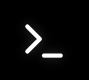

# Dokončenie spracovania

Akonáhle nástroj Chloros dokončí spracovanie, je čas skontrolovať výsledky, overiť kvalitu výstupu a pripraviť spracované obrázky na použitie vo vašom pracovnom postupe. Táto stránka vás prevedie záverečnými krokmi a ďalšími úkonmi.

## Indikácia dokončenia spracovania

Keď sa spracovanie úspešne dokončí, uvidíte niekoľko indikátorov:

* ✅ **Indikátor priebehu**: Dosiahne 100 % dokončenia
* ✅ **Log ladiaceho režimu**: Zobrazí správu „Spracovanie dokončené“
* ✅ **Tlačidlo Štart**: Znovu sa aktivuje (pripravené na ďalšie spustenie spracovania)
* ✅ **Výstupné súbory**: Všetky spracované obrázky sú uložené v podpriečinku modelu fotoaparátu***

## Vyhľadanie spracovaných obrázkov

### Otvorenie výstupného priečinka

1. Kliknite na ikonu **Hlavné menu**  (vľavo hore)
2. Vyberte **„Otvoriť priečinok projektu“**

3. Otvorí sa priečinok projektu v prehliadači súborov
4. Vyhľadajte projekt podľa názvu

***

## Prezeranie spracovaných obrázkov

### Rýchly náhľad v prehliadači súborov

**Windows vstavaný náhľad:**

1. Prejdite do podadresára modelu kamery
2. Vyberte obrazový súbor
3. Náhľad sa zobrazí v Windows okne náhľadu prehliadača
4. Pomocou klávesov so šípkami prechádzajte medzi obrázkami

### Náhľad v externých prehliadačoch obrázkov

**Odporúčané prehliadače:*** **QGIS** – bezplatný GIS softvér (najlepší pre georeferencovanú multispektrálnu analýzu)
* **IrfanView** – rýchly, ľahký prehliadač obrázkov (podporuje TIFF)
* **Adobe Photoshop** – profesionálna úprava (podpora formátu TIFF)
* **GIMP** – bezplatná alternatíva k programu Photoshop
* **Windows Photos** – základné prezeranie (nemusí podporovať 16-bitový formát TIFF)

### Náhľad v prehliadači obrázkov Chloros

Na pokročilú vizualizáciu použite vstavaný prehliadač obrázkov Chloros:

1. Kliknite na miniatúru obrázku v prehliadači súborov
2. Obrázok sa otvorí v hlavnej oblasti náhľadu
3. Kliknite na kartu **Prehliadač obrázkov**  v ľavom bočnom paneli
4. Použite [Index/LUT Sandbox](../image-viewer-gui/index-lut-sandbox.md) na interaktívnu analýzu

Podrobné pokyny nájdete v [Prehliadači obrázkov](../image-viewer-gui/opening-an-image-full-screen.md).

***

## Kontrola protokolu ladenia

### Skontrolujte, či sa nezobrazujú varovania alebo chyby

1. Otvorte kartu **Log ladenia**  2. Prejdite správami
3. Hľadajte žlté varovania alebo červené chyby
4. Skontrolujte všetky zaznamenané problémy
5. Kontaktujte podporu MAPIR pre pomoc

### Uloženie protokolu

Ak chcete uchovať záznam o spracovaní alebo ho poslať podpore MAPIR:

1. Kliknite na tlačidlo **„Kopírovať“**alebo**„Stiahnuť“**

2. Uložte ako textový súbor do priečinka projektu
3. Priložte k dokumentácii projektu
4. V prípade problémov pošlite podpore MAPIR

***

## Bežné problémy s výstupom a riešenia

### Problém: Chýbajúce výstupné súbory

**Možné príčiny:**

* Súbory nespĺňali kritériá spracovania
* Obrazy určené len pre cieľ (vylúčené z exportu)
* Počas exportu došlo k vyčerpaniu miesta na disku
* Poškodenie súboru počas spracovania

**Riešenia:**

1. Skontrolujte protokol ladenia, či neobsahuje správy o preskočení/chybách
2. Overte, či bolo na disku dostatok miesta
3. Spočítajte súbory: Počet by mal zodpovedať (pôvodný počet – cieľový počet) × (indexy + 1)
4. Znovu importujte a spracujte chýbajúce súbory

### Problém: Tmavé alebo svetlé okraje (vignetting je stále viditeľný)

**Možné príčiny:**

* Korekcia vignettingu je vypnutá
* Fotoaparát/objektív nie je v databáze profilov Chloros
* Extrémny vignetting presahujúci možnosti korekcie

**Riešenia:**

1. Overte, či bola korekcia vinetácie povolená v nastaveniach projektu
2. Skontrolujte, či bol správne detekovaný model fotoaparátu
3. Ak vinetácia pretrváva, kontaktujte podporu MAPIR

### Problém: Nesprávne farby alebo hodnoty

**Možné príčiny:**

* Neboli detekované kalibračné ciele
* Bol vybraný nesprávny model kalibračného cieľa
* Kalibrácia odrazivosti je vypnutá
* Nízka kvalita obrázkov cieľov

**Riešenia:**

1. Overte, či bola povolená kalibrácia odrazivosti
2. Skontrolujte správy „Cieľ nájdený“ v ladiacom protokole
3. Skontrolujte kvalitu obrázkov cieľov
4. Spracujte znovu so správne označenými cieľmi

### Problém: Hodnoty NDVI sa zdajú nesprávne

**Očakávané rozsahy NDVI:*** **Voda, skaly, pôda**: -0,1 až 0,2
* **Riedka/nezdravá vegetácia**: 0,2 až 0,4
* **Stredná vegetácia**: 0,4 až 0,6
* **Zdravá, hustá vegetácia**: 0,6 až 0,9**Ak sú hodnoty mimo týchto rozsahov:**

1. Overte, či bola použitá kalibrácia odrazivosti
2. Overte, či bol zahrnutý protokol svetelného senzora
3. Skontrolujte, či boli detekované kalibračné ciele
4. Uistite sa, že bol detekovaný správny model kamery
5. Skontrolujte načasovanie a podmienky snímania cieľového obrazu

***

## Používanie spracovaných snímok

### Pre fotogrametriu / tvorbu ortomozaiky

**Odporúčaný postup:**

1.**Importujte kalibrované snímky odrazivosti** do fotogrametrického softvéru:
   * Pix4Dmapper
   * Agisoft Metashape
   * DroneDeploy
   * WebODM
2. **Zachovajte metadáta EXIF**: Uistite sa, že sú zachované údaje GPS pre geotagovanie
3. **Kalibrované pracovné postupy**: Použite snímky odrazivosti pre vedeckú presnosť
4. **Spracujte indexové mozaiky**: Vytvorte ortomozaiky NDVI z jednotlivých indexových snímok
5. **Exportujte georeferencované GeoTIFF**: Pre použitie v GIS aplikáciách

### Pre GIS analýzu

**Odporúčaný pracovný postup:**

1.**Načítajte do QGIS, ArcGIS alebo podobného programu**

2.**Použite 16-bitové TIFF** odrazové snímky pre viacpásmovú analýzu
3. **Použite indexové snímky** (NDVI, NDRE) ako pripravené vrstvy vegetácie
4. **Rastrový kalkulátor**: Kombinujte pásma pre vlastnú analýzu
5. **Export**: Vytvorte klasifikačné mapy, detekciu zmien, mapy zdravotného stavu vegetácie

### Pre priamu analýzu / vykazovanie

**Odporúčaný postup:**

1.**Použite indexové snímky s farbami LUT** pre vizuálne správy
2. **Extrahujte štatistiky**: Priemerná hodnota NDVI na pole/parcelu
3. **Časové rady**: Porovnajte indexy medzi viacerými sedeniami
4. **Vytvorte správy**: Zahrňte mapy, štatistiky a vizualizácie***

## Archivácia a zálohovanie

### Odporúčaná stratégia zálohovania

**Čo uložiť:*** ✅ **Pôvodné obrázky vo formáte RAW/JPG** – archivujte na samostatnom disku/v cloude
* ✅ **Spracované výstupy** – uchovajte kalibrované obrázky a indexy
* ✅ **Súbor projektu** – obsahuje všetky nastavenia pre opätovné spracovanie v prípade potreby
* ✅ **Log ladiaceho procesu** – dokumentuje podrobnosti spracovania
* ✅ **Obrázky kalibračných cieľov** - Na overenie a opätovné spracovanie**Odporúčania pre ukladanie:*** **Okamžité zálohovanie**: Externý pevný disk
* **Dlhodobý archív**: Ukladanie v cloude (Google Drive, Dropbox atď.)
* **Kritické údaje**: Uložte 2–3 kópie na rôznych miestach***

## Ďalšie spracovania

### Opätovné použitie nastavení projektu

Ak budete v budúcnosti spracovávať podobné súbory údajov:

1. **Uložte šablónu projektu** (ak ste tak ešte neurobili)
2. **Vytvorte nový projekt** pomocou uloženej šablóny
3. **Importujte nové obrázky**

4.**Spracujte**s identickými nastaveniami pre zachovanie konzistencie

### Hromadné spracovanie viacerých relácií

Pre viaceré relácie/súbory údajov:**Možnosť 1: GUI – Viac projektov**

* Vytvorte samostatný projekt pre každú reláciu
* Použite konzistentné nastavenia šablóny
* Spracúvajte po jednom

**Možnosť 2: Chloros CLI (len Chloros+)**

* Automatizujte hromadné spracovanie
* Spracúvajte viacero zložiek pomocou skriptov
* Pozrite si [Dokumentáciu k CLI](../CLI.md)

**Možnosť 3: Python SDK (len pre verzie od Chloros)**

* Programové ovládanie
* Integrácia s analytickými postupmi
* Pozrite si [API Dokumentácia](../api-python-sdk.md)

***

## Riešenie problémov pri následnom spracovaní

### Opätovné spracovanie s odlišnými nastaveniami

Ak výsledky nie sú uspokojivé:

1. Zachovajte pôvodné obrázky (nikdy ich nemazajte)
2. Otvorte ten istý projekt v Chloros
3. Upravte nastavenia v paneli Nastavenia projektu
4. Spracujte znovu – výstupy prepíšu predchádzajúce výsledky

### Spracovanie podmnožiny obrázkov

Ak chcete spracovať len konkrétne obrázky:

1. Vytvorte nový projekt
2. Importujte len obrázky, ktoré potrebujú opätovné spracovanie
3. Použite rovnakú šablónu nastavení
4. Spracujte menší súbor údajov

### Získanie pomoci

Ak narazíte na problémy:

* 📧 **E-mail**: info@mapir.camera (priložte protokol ladenia)
* 🌐 **Podpora**: [https://www.mapir.camera/community/contact](https://www.mapir.camera/community/contact)
* 📚 **FAQ**: [Často kladené otázky](../faq.md)
* 📖 **Dokumentácia**: [Chloros Manuál](../)***

## Zhrnutie: Kompletný pracovný postup

Teraz ste dokončili celý pracovný postup spracovania Chloros:

1. ✅ **Vytvorený projekt** – Pozrite si [Projekty](../projects.md)
2. ✅ **Pridali ste súbory** – pozrite si [Pridávanie súborov](adding-files-to-a-project.md)
3. ✅ **Upravili ste nastavenia** – pozrite si [Úprava nastavení projektu](adjusting-project-settings.md)
4. ✅ **Označené ciele** – pozri [Výber cieľových obrázkov](choosing-target-images.md)
5. ✅ **Spustené spracovanie** – pozri [Spustenie spracovania](starting-the-processing.md)
6. ✅ **Sledovaný priebeh** – pozri [Sledovanie spracovania](monitoring-the-processing.md)
7. ✅ **Skontrolované výsledky** – táto stránka**Tvoje kalibrované multispektrálne snímky s korekciou odrazivosti sú pripravené na analýzu!**

***

## Ďalšie zdroje

### Pokročilé funkcie

* [**Prehliadač snímok**](../image-viewer-gui/opening-an-image-full-screen.md) – Interaktívna vizualizácia a analýza
* [**Index/LUT Sandbox**](../image-viewer-gui/index-lut-sandbox.md) – Testovanie vlastných indexov
* [**Vzorce multispektrálnych indexov**](../project-settings/multispectral-index-formulas.md) – Kompletný referenčný zoznam indexov

### Automatizácia a integrácia

* [**Dokumentácia CLI**](../CLI.md) – Hromadné spracovanie z príkazového riadku
* [**Python SDK**](../api-python-sdk.md) – Programová automatizácia
* [**Chloros+ Funkcie**](../#chloros) – Pokročilé možnosti spracovania

### Podpora a vzdelávanie

* [**Často kladené otázky**](../faq.md) – Odpovede na bežné otázky
* [**Kalibračné terče**](../calibration-targets.md) – Vysvetlenie kalibrácie odrazivosti
* [**Podporované kamery**](../supported-cameras.md) – Kompatibilný hardvér
