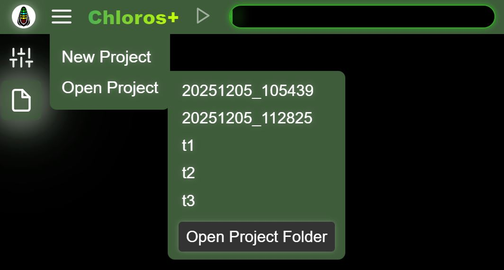

# Grafické rozhranie: Projekty

Chloros vám umožňuje vytvárať projekty, ktoré je možné v budúcnosti opäť otvoriť.

## Nový projekt

<figure><figcaption></figcaption></figure>Z hlavného menu vyberte „Nový projekt“ a zadajte jedinečný názov pre váš projekt.

## Otvoriť projekt

<figure><figcaption></figcaption></figure>Vyberte „Otvoriť projekt“, aby sa zobrazil zoznam existujúcich projektov v priečinku Projekt. Ak neexistujú žiadne projekty, sekundárne bočné menu sa neotvorí. Na vyššie uvedenej fotografii môžete vidieť niektoré projekty vytvorené prostredníctvom grafického rozhrania (t1, t2, t3). Projekty DATE\_TIME boli vytvorené programom CLI pomocou predvoleného schématu pomenovania projektov. Kliknutím na akýkoľvek názov projektu ho otvoríte.

Kliknutím na tlačidlo „Otvoriť priečinok projektu“ otvoríte prehliadač súborov vášho počítača v umiestnení projektu. Umiestnenie projektu môžete upraviť v [Nastaveniach projektu](project-settings/project-settings.md).

## Pridať súbory

Po otvorení projektu vyberte v hlavnom menu položku „Pridať súbory“, aby ste do aktuálneho projektu pridali jednotlivé obrazové súbory. Táto funkcia zodpovedá funkcii pridávania v prehliadači súborov, ale pre väčšie pohodlie je prístupná priamo z hlavného menu.

## Pridať zložku

Po otvorení projektu vyberte v hlavnom menu položku „Pridať zložku“, aby ste do aktuálneho projektu pridali celú zložku s obrázkami. Duplicitné súbory sa ignorujú.

## Spustiť / Zastaviť spracovanie

Po pridaní súborov do projektu sa v hlavnom menu sprístupní položka „Spustiť spracovanie“. Ide o rovnakú akciu ako kliknutie na tlačidlo Prehrať/Spustiť v hornom záhlaví. Počas spracovania sa položka menu zmení na „Zastaviť spracovanie“, aby ste mohli zastaviť spracovanie.


Položky ponuky Pridať súbory, Pridať zložku a Spustiť/Zastaviť spracovanie sú viditeľné alebo aktívne len vtedy, keď je projekt otvorený a boli pridané súbory. Poskytujú rýchly prístup k akciám, ktoré sú k dispozícii aj prostredníctvom bočného panela prehliadača súborov a tlačidiel v hlavičke.

